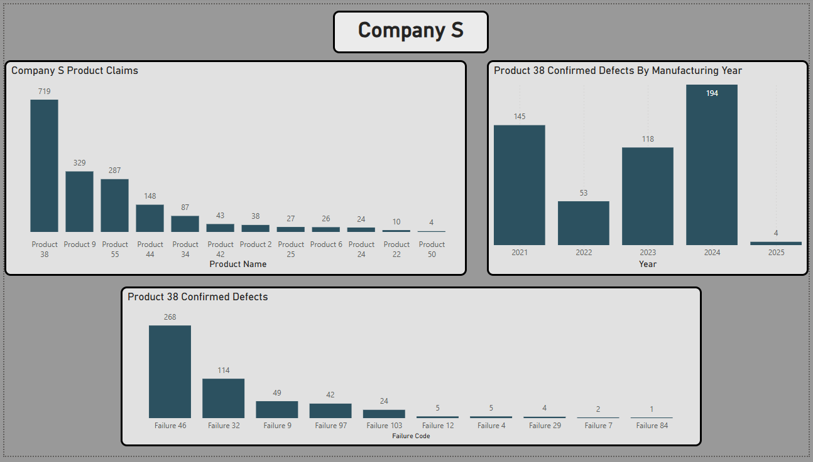
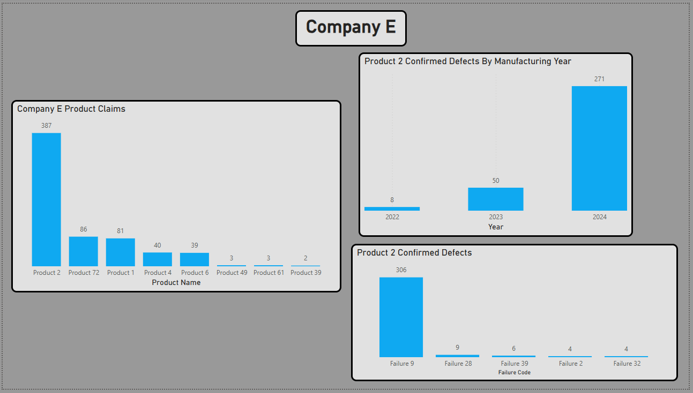

# PPM Dashboard

The following Power BI dashboards analyze PPM data collected over a three-year period. This project was developed during a Supply Chain internship to identify recurring defects, determine their root causes, and analyze the affected products. The dashboards were used to inform quality improvement efforts and recommend corrective actions.

*The data has been altered to protect company privacy. All names and personal identifiers are anonymized and replaced with generic values.*

*Over 40 customer accounts, 70 products, and 100 failure modes were part of this analysis, but for visibility and clarity within the data models, only the most prevalent items are highlighted in the dashboards.*

## Scope

- Frequency of claims
- Affected records and models
- Defect responsibility
- Problematic manufacturing years
- Failure modes
- Defect location

## Main Dashboard

### Insights

- "Company C" is responsible for the most defect claims
- Products manufactured in 2023 and 2024 experienced a spike in claims with a significant drop-off in 2025 
- In both defect claims and confirmed claims, the customer is the main party responsible for the failures
- The confirmed defects are significantly fewer than the claimed defects by customers
- Model 1 is the most defective record
- Most defects were identified on the assembly line or in the field
  

## Top Affected Customers

### Insights

- Out of the product line, Product 66 is continuously the most defective
- Products manufactured in 2023 are the most defective
- Failure 93 is the main reason for defects, followed by Failure 89

### Insights 

- Product 38 is continuously the most defective for Company S
- Products manufactured in 2024 are the most defective
- Failure 46 is the main reason for defects, followed by Failure 32
  

### Insights 

- Product 2 is overwhelmingly the most defective product
- Products manufactured in 2024 are the most defective
- Failure 9 is the main reason for defects
  

### Insights

- Product 18 is the most defective product
- Product 18 only sees defects from the 2021 manufacturing year
- Failure 103 is the reason for the defects

## Top 15 Defective Products

### Insights

- Product 66 is the most defective product out of the entire product line
- Confirmed defects are lower than customer-reported levels, though the same products consistently appear as problem areas
- Product 71 has the largest percentage of products that are falsely claimed as defective (83%), indicating a high level of user error

## Impact

These dashboards provide a clear view of which products are defective, how they fail, and the underlying causes of those failures. The data models identify dimensions that are consistently problematic, helping direct improvement efforts toward the highest-impact areas. When combined with business context, such as COGS, revenue impact, customer value, and labor and time costs, leaders gain a comprehensive perspective on where corrective actions will deliver the greatest value. Together, these insights support informed, data-driven decision-making focused on defect reduction and continuous improvement.
